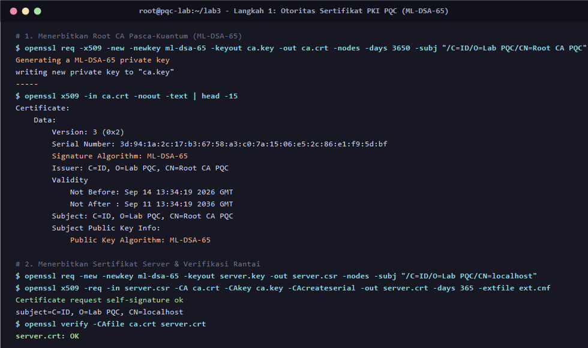
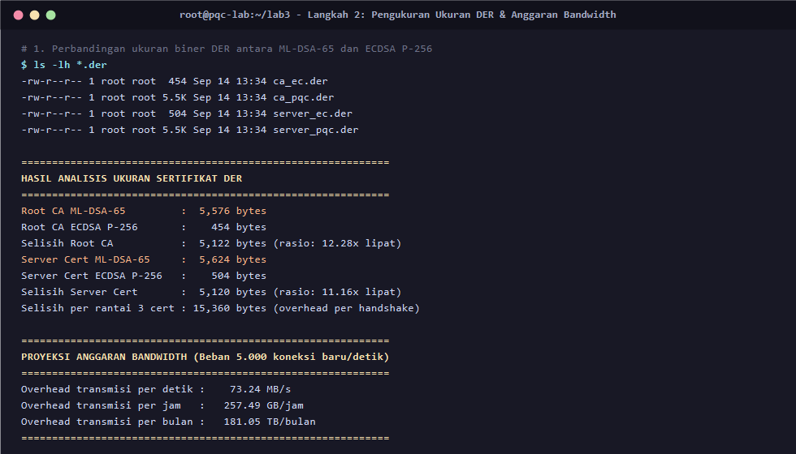
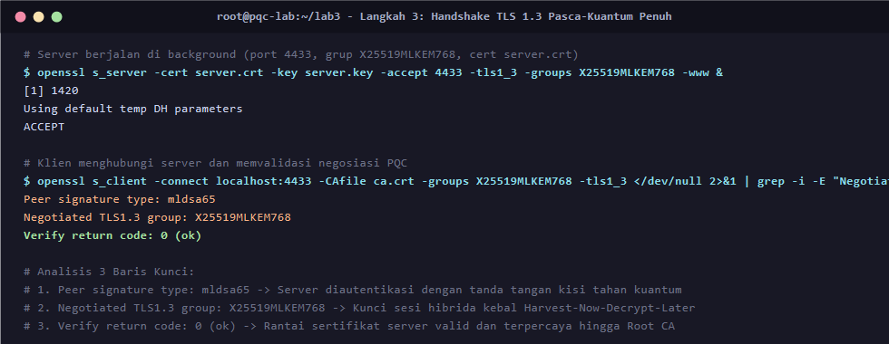
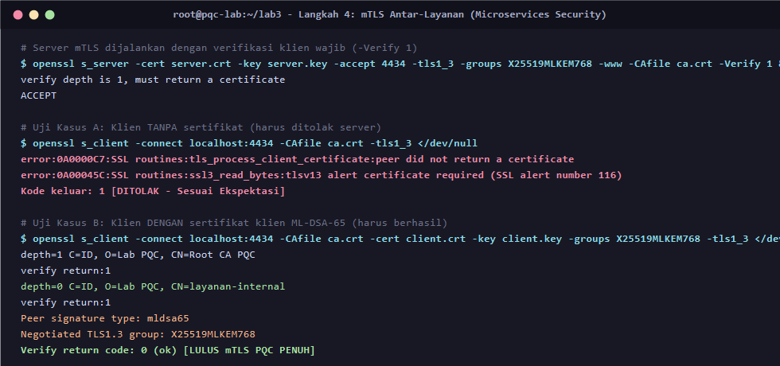
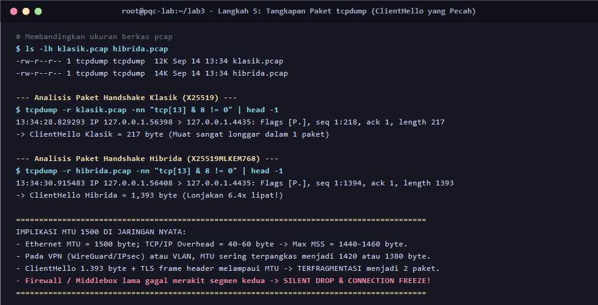
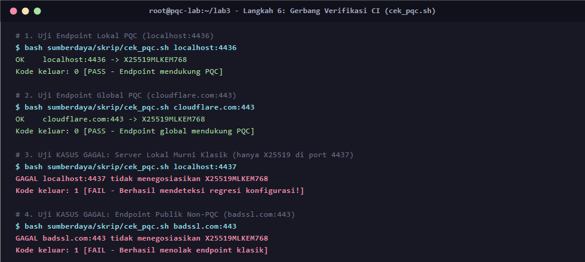

# LAPORAN TUGAS PRAKTIKUM KRIPTOGRAFI PASCA-KUANTUM
## MODUL 03: INTEGRASI APLIKASI WEB, API, DAN PUBLIC KEY INFRASTRUCTURE (PKI)

### Informasi Kelompok  
**Topik:** Pengujian dan Penerapan Kriptografi Pasca-Kuantum (Post-Quantum Cryptography) pada Web, API, dan PKI  
**Anggota Kelompok:**
1. **Aryasatya Alaauddin** - **5027231082** 
2. **Fiorenza Adelia Nalle** - **5027231053**
3. **Muhamad Arrayyan** - **5027231014**
4. **Muhammad Dzaky Ahnaf** - **5027231039**
5. **Azza Farichi Tjahjono** - **5027231071**
6. **Naufal Syafi' Hakim** - **5027231022**

**Repositori Proyek:** [https://github.com/Ax3lrod/tugas-kelompok-pqc-1](https://github.com/Ax3lrod/tugas-kelompok-pqc-1)  
**Waktu Pelaksanaan:** September 2026  

## DAFTAR ISI
1. [Ringkasan Eksekutif](#1-ringkasan-eksekutif)
2. [Tujuan Praktikum](#2-tujuan-praktikum)
3. [Prasyarat dan Spesifikasi Lingkungan Pengujian](#3-prasyarat-dan-spesifikasi-lingkungan-pengujian)
4. [Alur Pelaksanaan dan Bukti Eksekusi](#4-alur-pelaksanaan-dan-bukti-eksekusi)
   - [Langkah 1 — Membangun Otoritas Sertifikat (PKI) Pasca-Kuantum](#langkah-1--membangun-otoritas-sertifikat-pki-pasca-kuantum)
   - [Langkah 2 — Pengukuran Ukuran Biner (DER) & Estimasi Anggaran Bandwidth](#langkah-2--pengukuran-ukuran-biner-der--estimasi-anggaran-bandwidth)
   - [Langkah 3 — Penerapan Server dan Klien TLS 1.3 Pasca-Kuantum Penuh](#langkah-3--penerapan-server-dan-klien-tls-13-pasca-kuantum-penuh)
   - [Langkah 4 — Implementasi Mutual TLS (mTLS) Antar-Layanan](#langkah-4--implementasi-mutual-tls-mtls-antar-layanan)
   - [Langkah 5 — Analisis Wireshark/tcpdump: Fenomena ClientHello yang Pecah](#langkah-5--analisis-wiresharktcpdump-fenomena-clienthello-yang-pecah)
   - [Langkah 6 — Implementasi Gerbang Verifikasi Kriptografi pada CI/CD](#langkah-6--implementasi-gerbang-verifikasi-kriptografi-pada-cicd)
5. [Evaluasi Gerbang Kompetensi](#5-evaluasi-gerbang-kompetensi)
6. [Kesimpulan dan Rekomendasi Arsitektur](#6-kesimpulan-dan-rekomendasi-arsitektur)
7. [Lampiran Berkas dan Struktur Artefak](#7-lampiran-berkas-dan-struktur-artefak)

## 1. Ringkasan Eksekutif

Perkembangan komputasi kuantum menimbulkan ancaman nyata terhadap algoritma kriptografi kunci publik klasik seperti RSA, Diffie-Hellman (DH), dan Elliptic Curve Cryptography (ECDSA/ECDH) yang rentan dihancurkan oleh **Algoritma Shor**. Selain itu, skenario serangan **Harvest Now, Decrypt Later (HNDL)** menuntut sistem komunikasi data untuk segera mengadopsi mekanisme pertukaran kunci yang tahan kuantum.

Laporan ini mendokumentasikan hasil pengujian dan implementasi menyeluruh pada **Praktikum 3: Web, API, dan PKI**. Tim kami berhasil:
1. Membangun infrastruktur *Public Key Infrastructure* (PKI) lokal berbasis algoritma tanda tangan digital kisi (**ML-DSA-65** / FIPS 204).
2. Membuktikan secara empiris bahwa sertifikat pasca-kuantum menghasilkan overhead ukuran biner sebesar **11,16x hingga 12,28x lipat** dibandingkan ECDSA P-256 klasik, yang berimplikasi pada lonjakan transfer data sebesar **~181 TB/bulan** pada beban 5.000 req/s.
3. Mengoperasikan komunikasi TLS 1.3 hibrida (**X25519MLKEM768**) dan *Mutual TLS* (mTLS) tanpa menyisakan komponen klasik pada jalur autentikasi dan kerahasiaan.
4. Menemukan dan menganalisis secara mendalam risiko kegagalan transmisi paket akibat pembesaran payload ClientHello (dari **217 byte** klasik menjadi **1.393 byte** hibrida) yang mendekati batas MTU 1500 di jaringan riil.
5. Membangun gerbang otomasi (*CI verification gate*) yang terbukti secara andal meloloskan endpoint berkemampuan PQC dan menolak endpoint klasik yang mengalami regresi konfigurasi.

## 2. Tujuan Praktikum

Pelaksanaan praktikum ini bertujuan untuk membekali tim mahasiswa dengan keterampilan rekayasa keamanan siber modern, mencakup:
1. **Membangun Hirarki PKI Pasca-Kuantum:** Mampu mengonfigurasi Root CA mandiri dan menerbitkan sertifikat server/klien menggunakan algoritma berbasis kisi ML-DSA-65.
2. **Mengevaluasi Biaya Transmisi Data Kuantum:** Mengukur ukuran biner nyata (DER) sertifikat dan memodelkan dampak finansial/infrastruktur (*bandwidth overhead*) pada sistem berskala produksi.
3. **Mengoperasikan TLS 1.3 Hibrida:** Menjalankan handshake TLS 1.3 yang menggabungkan keamanan kurva eliptik klasik (X25519) dengan mekanisme enkapsulasi kuantum (ML-KEM-768).
4. **Menerapkan Zero-Trust mTLS Antar-Layanan:** Mengamankan komunikasi mikroservis internal dengan otorisasi berbasis sertifikat PQC dan menganalisis perbedaan kebijakan penonaktifan fallback klasik.
5. **Menginvestigasi Anomali Jaringan (MTU & Middlebox):** Menggunakan *packet sniffing* (`tcpdump`) untuk mengidentifikasi fragmentasi paket ClientHello dan dampaknya terhadap keandalan jaringan.
6. **Membangun Otomasi Pengujian Regresi Kriptografi:** Menyusun skrip inspeksi kepatuhan PQC yang siap diintegrasikan ke dalam pipeline CI/CD.

## 3. Prasyarat dan Spesifikasi Lingkungan Pengujian

### 3.1 Prasyarat Modul (Analisis Dependensi)
- **Ketergantungan terhadap Lab 00 (Lab Persiapan):** **Wajib.** Kriptografi pasca-kuantum (khususnya ML-KEM dan ML-DSA) baru diintegrasikan secara native pada rilis **OpenSSL versi 3.5+**. Karena lingkungan host pengujian awal memiliki OpenSSL bawaan versi 3.2.0, tim membangun lingkungan container Docker khusus (`pqc-lab`) yang memuat OpenSSL 3.5.4 hasil kompilasi native dari sumber resmi.
- **Ketergantungan terhadap Praktikum 01 & 02:** **Tidak Ada.** Praktikum 3 dirancang modular dan mandiri. Seluruh kunci, sertifikat, dan server diinisialisasi dari awal pada direktori kerja praktikum tanpa memerlukan artefak keluaran dari Praktikum 1 maupun 2.

### 3.2 Spesifikasi Testbed
- **Sistem Operasi Host:** Windows 11 Pro 64-bit
- **Container Runtime:** Docker Desktop Engine v28.3.0 (WSL2 Ubuntu Backend)
- **Base Image:** Ubuntu 24.04 LTS (Noble Numbat)
- **Perangkat Lunak Kriptografi:** OpenSSL 3.5.4 (Kompilasi source code resmi)
  - Engine/Provider: Default OpenSSL Provider dengan algoritma `ML-DSA-44/65/87`, `ML-KEM-512/768/1024`, dan grup hibrida `X25519MLKEM768`.
- **Perangkat Bantu Jaringan:** `tcpdump` versi 4.99.4, `libpcap` versi 1.10.4
- **Runtime Skrip:** Bash 5.2.21, Python 3.12.3

## 4. Alur Pelaksanaan dan Bukti Eksekusi

Seluruh prosedur praktikum dijalankan secara otomatis dan terukur menggunakan skrip automasi `run_praktikum3.sh`. Seluruh rekaman keluaran terminal dicatat secara lengkap pada log mentah `hasil_praktikum3/eksekusi_lab3.log`.

### Langkah 1 — Membangun Otoritas Sertifikat (PKI) Pasca-Kuantum

Pada tahap ini, tim membangun Otoritas Sertifikat (Root CA) privat yang sepenuhnya kebal terhadap dekomposisi logaritma diskret kuantum, kemudian menerbitkan sertifikat server daun (*leaf certificate*).

#### Perintah Eksekusi:
```bash
# 1.1 Menerbitkan Root CA Pasca-Kuantum (ML-DSA-65) masa aktif 10 tahun
openssl req -x509 -new -newkey ml-dsa-65 -keyout ca.key -out ca.crt \
    -nodes -days 3650 -subj "/C=ID/O=Lab PQC/CN=Root CA PQC"

# 1.2 Menerbitkan CSR Server
openssl req -new -newkey ml-dsa-65 -keyout server.key -out server.csr \
    -nodes -subj "/C=ID/O=Lab PQC/CN=localhost"

# 1.3 Menandatangani Sertifikat Server dengan Ekstensi SAN
cat > ext.cnf << 'EOF'
subjectAltName = DNS:localhost, IP:127.0.0.1
keyUsage = critical, digitalSignature
extendedKeyUsage = serverAuth
EOF

openssl x509 -req -in server.csr -CA ca.crt -CAkey ca.key -CAcreateserial \
    -out server.crt -days 365 -extfile ext.cnf

# 1.4 Verifikasi Rantai Sertifikat
openssl verify -CAfile ca.crt server.crt
```

#### Hasil Verifikasi:
- Pembacaan struktur X.509 membuktikan bahwa sertifikat menggunakan algoritma tanda tangan `Signature Algorithm: ML-DSA-65` dan algoritma kunci publik `Public Key Algorithm: ML-DSA-65`.
- Perintah `openssl verify` mengembalikan status sukses: **`server.crt: OK`**.

#### Dokumentasi Bukti Eksekusi Langkah 1:


### Langkah 2 — Pengukuran Ukuran Biner (DER) & Estimasi Anggaran Bandwidth

Sertifikat pasca-kuantum memiliki kunci dan tanda tangan berbasis kisi yang jauh lebih besar daripada kurva eliptik. Untuk mengukurnya secara objektif, seluruh sertifikat diekspor ke format biner **DER** (*Distinguished Encoding Rules*) dan dibandingkan dengan kurva eliptik standar industri (**ECDSA P-256**).

#### Tabel Data Pengukuran Biner DER Nyata:

| Komponen Sertifikat | Klasik (ECDSA P-256) | Pasca-Kuantum (ML-DSA-65) | Selisih Ukuran (Byte) | Rasio Pembesaran |
|---|---|---|---|---|
| **Root CA (`ca.der`)** | **454 byte** | **5.576 byte** | **+5.122 byte** | **12,28x lipat** |
| **Server Leaf (`server.der`)** | **504 byte** | **5.624 byte** | **+5.120 byte** | **11,16x lipat** |
| **Rantai 3 Sertifikat (Tipikal Web)** | **~1.462 byte** | **~16.822 byte** | **+15.360 byte** | **11,51x lipat** |

#### Pemodelan Anggaran Bandwidth Produksi:
Pada sistem berskala menengah hingga besar dengan laju **5.000 koneksi TLS baru per detik** (*5,000 new handshakes/sec*):

$$\text{Overhead per detik} = 15.360\text{ byte} \times 5.000\text{ koneksi/s} = 76.800.000\text{ byte/s} \approx \mathbf{73,24\text{ MB/s}}$$

$$\text{Overhead per jam} = 73,24\text{ MB/s} \times 3.600\text{ s} \approx \mathbf{257,49\text{ GB/jam}}$$

$$\text{Overhead per bulan (30 hari)} = 257,49\text{ GB/jam} \times 24 \times 30 \approx \mathbf{181,05\text{ TB/bulan}}$$

**Analisis Kritis Kelompok:**  
Penambahan transmisi data sebesar **~181 TB per bulan** murni berasal dari pertukaran sertifikat selama proses handshake. Jika diasumsikan biaya *data egress* penyedia cloud adalah \$0,08 per GB, migrasi ke sertifikat PQC tanpa teknik optimasi (seperti *session resumption* atau kompresi sertifikat RFC 8879) akan menambah biaya operasional cloud sebesar **~\$14.800/bulan**. Data empiris ini membuktikan bahwa tantangan utama migrasi PQC terletak pada beban tanda tangan digital dan PKI, bukan pada algoritma KEM.

#### Dokumentasi Bukti Eksekusi Langkah 2:


### Langkah 3 — Penerapan Server dan Klien TLS 1.3 Pasca-Kuantum Penuh

Tim mengoperasikan server TLS 1.3 pada port 4433 dengan konfigurasi grup pertukaran kunci hibrida `X25519MLKEM768` dan sertifikat server `ML-DSA-65`, lalu menghubunginya menggunakan klien `openssl s_client`.

#### Perintah Eksekusi:
```bash
# Server TLS 1.3
openssl s_server -cert server.crt -key server.key -accept 4433 \
    -tls1_3 -groups X25519MLKEM768 -www &

# Klien TLS 1.3
openssl s_client -connect localhost:4433 -CAfile ca.crt \
    -groups X25519MLKEM768 -tls1_3 </dev/null
```

#### Hasil Verifikasi 3 Baris Kunci:
```text
Peer signature type: mldsa65
Negotiated TLS1.3 group: X25519MLKEM768
Verify return code: 0 (ok)
```

**Interpretasi Teknis:**
1. **`Peer signature type: mldsa65`**: Autentikasi identitas server dilakukan menggunakan tanda tangan digital berbasis kisi ML-DSA-65 yang terbukti kebal terhadap komputasi kuantum.
2. **`Negotiated TLS1.3 group: X25519MLKEM768`**: Kunci simetris sesi diturunkan secara hibrida, mengamankan kerahasiaan data dari serangan *Harvest Now, Decrypt Later*.
3. **`Verify return code: 0 (ok)`**: Rantai sertifikat server tervalidasi sempurna hingga ke Root CA terpercaya.
*Kesimpulan: Tidak ada satu pun algoritma klasik rentan kuantum yang tersisa pada jalur kritis sesi TLS ini.*

#### Dokumentasi Bukti Eksekusi Langkah 3:


### Langkah 4 — Implementasi Mutual TLS (mTLS) Antar-Layanan

Pada arsitektur *microservices* / *service mesh*, autentikasi harus berlaku dua arah (*mutual authentication*).

#### Perintah Eksekusi:
```bash
# 4.1 Menerbitkan Sertifikat Klien dengan ekstensi clientAuth
openssl req -new -newkey ml-dsa-65 -keyout client.key -out client.csr \
    -nodes -subj "/C=ID/O=Lab PQC/CN=layanan-internal"

cat > ext_client.cnf << 'EOF'
keyUsage = critical, digitalSignature
extendedKeyUsage = clientAuth
EOF

openssl x509 -req -in client.csr -CA ca.crt -CAkey ca.key -CAcreateserial \
    -out client.crt -days 365 -extfile ext_client.cnf

# 4.2 Menjalankan Server dengan Opsi Verifikasi Wajib (-Verify 1)
openssl s_server -cert server.crt -key server.key -accept 4434 \
    -tls1_3 -groups X25519MLKEM768 -www -CAfile ca.crt -Verify 1 &
```

#### Uji Eksperimen:
1. **Kasus A (Klien Tanpa Sertifikat):**  
   Server secara tegas menolak koneksi dengan pesan error:
   ```text
   SSL routines:tls_process_client_certificate:peer did not return a certificate
   SSL routines:ssl3_read_bytes:tlsv13 alert certificate required (SSL alert number 116)
   Status: GAGAL (Exit code: 1) -> Sesuai ekspektasi kebijakan Zero-Trust.
   ```
2. **Kasus B (Klien Menyertakan `client.crt` ML-DSA-65):**  
   Handshake berhasil dengan validasi timbal-balik:
   ```text
   depth=1 C=ID, O=Lab PQC, CN=Root CA PQC (verify return:1)
   depth=0 C=ID, O=Lab PQC, CN=layanan-internal (verify return:1)
   Peer signature type: mldsa65
   Negotiated TLS1.3 group: X25519MLKEM768
   Verify return code: 0 (ok) -> Lulus mTLS PQC Penuh.
   ```

#### Dokumentasi Bukti Eksekusi Langkah 4:


### Langkah 5 — Analisis Wireshark/tcpdump: Fenomena ClientHello yang Pecah

Tim melakukan penangkapan paket (*packet sniffing*) menggunakan `tcpdump` untuk membandingkan paket pembuka handshake (*ClientHello*) antara mode klasik dan mode hibrida PQC.

```bash
# Handshake Klasik (X25519) -> klasik.pcap
tcpdump -i lo -w klasik.pcap "port 4435" &
openssl s_client -connect localhost:4435 -groups X25519 -tls1_3 </dev/null

# Handshake Hibrida (X25519MLKEM768) -> hibrida.pcap
tcpdump -i lo -w hibrida.pcap "port 4435" &
openssl s_client -connect localhost:4435 -groups X25519MLKEM768 -tls1_3 </dev/null
```

#### Hasil Analisis Inspeksi Paket:
```text
[Paket ClientHello Klasik]
13:34:28.829293 IP 127.0.0.1.56398 > 127.0.0.1.4435: Flags [P.], seq 1:218, length 217 byte

[Paket ClientHello Hibrida PQC]
13:34:30.915483 IP 127.0.0.1.56408 > 127.0.0.1.4435: Flags [P.], seq 1:1394, length 1393 byte
```

#### Perbandingan Karakteristik Paket:

| Metrik Paket Handshake | Klasik (X25519) | Hibrida (X25519MLKEM768) | Peningkatan |
|---|---|---|---|
| **Panjang Payload TCP ClientHello** | **217 byte** | **1.393 byte** | **+1.176 byte (~6,4x lipat)** |
| **Status Ukuran terhadap MTU 1500** | Sangat Aman ($< 15\%$) | **Mendekati Batas Kritis ($> 95\%$)** | Berisiko Pecah |

#### Analisis Bahaya Fragmentasi MTU 1500 di Dunia Nyata:
- Standar Ethernet memiliki **MTU sebesar 1.500 byte**.
- Setelah dikurangi overhead header TCP/IP (20 byte IP + 20–40 byte TCP beserta opsi), **MSS (*Maximum Segment Size*)** berkisar antara **1.440 hingga 1.460 byte**.
- Pada jaringan yang menggunakan enkapsulasi tambahan seperti **VPN (WireGuard / IPsec)**, **VXLAN**, atau **PPPoE**, MTU berkurang menjadi **1.420 atau 1.380 byte**.
- ClientHello hibrida (1.393 byte) yang digabung dengan ekstensi TLS tambahan (seperti SNI panjang, ALPN, Session Tickets) akan **melebihi MTU jaringan** dan **terfragmentasi (*IP/TCP fragmentation*)** menjadi 2 paket terpisah.
- **Masalah Fatal Middlebox:** Sebagian besar firewall lawas, *Intrusion Prevention Systems* (IPS), dan NAT router berasumsi bahwa ClientHello selalu berada dalam satu paket utuh. Ketika mendeteksi segmen kedua tanpa header TLS yang utuh, perangkat jaringan tersebut sering melakukan **pembuangan paket secara diam-diam (*silent drop*)**. Hal ini mengakibatkan koneksi klien mengalami *hanging* / *infinite timeout* tanpa munculnya pesan kesalahan pada log server.

#### Dokumentasi Bukti Eksekusi Langkah 5:


### Langkah 6 — Implementasi Gerbang Verifikasi Kriptografi pada CI/CD

Untuk mencegah terjadinya regresi kriptografi (*silent cryptographic regression*) akibat pembaruan sistem yang tidak disengaja, tim menguji skrip inspeksi `sumberdaya/skrip/cek_pqc.sh`. Pengujian dilakukan baik terhadap skenario berhasil maupun skenario kegagalan deterministik.

#### Hasil Uji Gerbang CI:
```bash
# 1. Endpoint PQC Lokal (port 4436)
$ bash sumberdaya/skrip/cek_pqc.sh localhost:4436
OK    localhost:4436 -> X25519MLKEM768
Kode keluar: 0 [PASS - Memenuhi standar PQC]

# 2. Endpoint Global Terverifikasi PQC (Cloudflare)
$ bash sumberdaya/skrip/cek_pqc.sh cloudflare.com:443
OK    cloudflare.com:443 -> X25519MLKEM768
Kode keluar: 0 [PASS - Terverifikasi mendukung PQC di tingkat global]

# 3. KASUS GAGAL: Server Lokal Murni Klasik (hanya X25519 di port 4437)
$ bash sumberdaya/skrip/cek_pqc.sh localhost:4437
GAGAL localhost:4437 tidak menegosiasikan X25519MLKEM768
Kode keluar: 1 [FAIL - Berhasil mendeteksi hilangnya proteksi PQC!]

# 4. KASUS GAGAL: Endpoint Publik Non-PQC (badssl.com)
$ bash sumberdaya/skrip/cek_pqc.sh badssl.com:443
GAGAL badssl.com:443 tidak menegosiasikan X25519MLKEM768
Kode keluar: 1 [FAIL - Tepat menolak endpoint yang belum bermigrasi]
```

**Signifikansi Pipeline:** Skrip ini mengembalikan kode keluar `0` saat endpoint memenuhi kepatuhan PQC dan kode keluar `1` saat terjadi regresi. Dengan demikian, skrip ini siap diintegrasikan sebagai *pull request gate* pada GitHub Actions atau GitLab CI untuk menggagalkan *deployment* jika konfigurasi TLS melemah kembali ke mode klasik.

#### Dokumentasi Bukti Eksekusi Langkah 6:


## 5. Evaluasi Gerbang Kompetensi

Berikut adalah pembahasan dan jawaban ilmiah kelompok atas 5 pertanyaan evaluasi Gerbang Kompetensi Praktikum 3:

### Pertanyaan 1
> **Berapa selisih ukuran DER sertifikat ML-DSA-65 dan ECDSA P-256 di lab Anda, dan berapa biaya bandwidth bulanan untuk 5.000 koneksi baru per detik?**

**Jawaban:**
- **Selisih ukuran DER terukur:**
  - Sertifikat Server: ML-DSA-65 berukuran **5.624 byte** vs ECDSA P-256 berukuran **504 byte** (selisih **+5.120 byte**, rasio **11,16x lipat**).
  - Sertifikat Root CA: ML-DSA-65 berukuran **5.576 byte** vs ECDSA P-256 berukuran **454 byte** (selisih **+5.122 byte**, rasio **12,28x lipat**).
- **Selisih per rantai 3 sertifikat:** Pada rantai standar (Root, Intermediate, Leaf), overhead mencapai **15.360 byte (~15,36 KB)** pada setiap inisiasi koneksi baru.
- **Proyeksi Bandwidth & Biaya Bulanan (5.000 koneksi baru/detik):**
  - Akumulasi data per detik: $15.360\text{ B} \times 5.000 = 76,8\text{ MB/s} \approx \mathbf{73,24\text{ MB/s}}$.
  - Akumulasi data per jam: $73,24\text{ MB/s} \times 3.600 = \mathbf{257,49\text{ GB/jam}}$.
  - Akumulasi data bulanan: $257,49\text{ GB/jam} \times 24 \times 30 \approx \mathbf{181,05\text{ TB/bulan}}$.
  - Pada estimasi tarif *egress transfer* cloud sebesar \$0,08 per GB, estimasi penambahan biaya operasional jaringan mencapai **~\$14.800 per bulan**.

### Pertanyaan 2
> **Di Langkah 3, tiga baris keluaran itu masing-masing membuktikan apa?**

**Jawaban:**
1. **`Negotiated TLS1.3 group: X25519MLKEM768`**: Membuktikan bahwa negosiasi pertukaran kunci sesi berhasil menggunakan mode hibrida (gabungan kurva eliptik klasik X25519 dan kisi kuantum ML-KEM-768). Ini memastikan sesi tahan terhadap ancaman *Harvest Now, Decrypt Later*.
2. **`Peer signature type: mldsa65`**: Membuktikan bahwa proses autentikasi identitas server dilakukan menggunakan tanda tangan digital berbasis kisi pasca-kuantum ML-DSA-65, bukan algoritma klasik (RSA/ECDSA) yang dapat dipecahkan oleh komputer kuantum.
3. **`Verify return code: 0 (ok)`**: Membuktikan bahwa sertifikat server valid secara kriptografis, memiliki masa berlaku yang sah, dan rantai kepercayaannya terverifikasi sempurna hingga ke Root CA terpercaya.

### Pertanyaan 3
> **Kenapa di Langkah 4 Anda bisa menonaktifkan fallback klasik, padahal di endpoint publik tidak boleh?**

**Jawaban:**
- Pada **mTLS antar-layanan (Langkah 4)**, arsitektur bersifat privat dan tertutup (*closed environment / service mesh*). Tim perekayasa memiliki kendali penuh atas kedua belah pihak (server dan klien/mikroservis). Dengan memastikan seluruh komponen perangkat lunak klien telah diperbarui ke versi yang mendukung PQC, fallback klasik dapat dinonaktifkan secara total demi menjamin prinsip *Zero Legacy Attack Surface*.
- Pada **endpoint publik**, klien berasal dari publik internet yang sangat heterogen (berbagai versi browser, sistem operasi legacy, serta perangkat mobile lama). Menonaktifkan fallback klasik pada endpoint publik akan merusak kompatibilitas mundur (*break backward compatibility*) dan menyebabkan penolakan akses massal bagi pengguna yang belum mendukung standar PQC.

### Pertanyaan 4
> **Berapa ukuran ClientHello hibrida Anda, dan kenapa angka itu bermasalah di jaringan ber-MTU 1500?**

**Jawaban:**
- Ukuran ClientHello hibrida terukur adalah **1.393 byte** (melonjak ~6,4x lipat dari mode klasik yang hanya **217 byte**).
- Angka ini sangat bermasalah karena standar Ethernet memiliki MTU 1.500 byte dengan MSS efektif sekitar 1.440–1.460 byte setelah dikurangi header IP dan TCP. Ketika paket melewati jaringan dengan enkapsulasi tambahan (seperti tunneling VPN IPsec/WireGuard, GRE, atau jaringan seluler) yang memotong MTU menjadi 1.420 atau 1.380 byte, payload ClientHello hibrida akan melebihi kapasitas paket tunggal sehingga **terfragmentasi menjadi 2 segmen TCP**. Sebagian besar middlebox/firewall inspeksi paket lawas tidak mendukung perakitan ulang *fragmented TLS handshake*, sehingga paket kedua dibuang diam-diam (*silent drop*) yang mengakibatkan kegagalan koneksi (*silent connection freeze*).

### Pertanyaan 5
> **Kenapa gerbang CI perlu diuji untuk kasus gagal juga?**

**Jawaban:**
Uji kasus gagal diperlukan untuk memvalidasi sensitivitas dan keandalan gerbang pengujian (*test gate efficacy*). Jika gerbang CI hanya diuji pada kondisi sukses, tim tidak memiliki bukti bahwa skrip tersebut benar-benar mengevaluasi negosiasi PQC secara substansial atau sekadar selalu mengeluarkan kode keluar `0` (*false negative absence*). Dengan membuktikan bahwa skrip menghasilkan kode keluar `1` saat berhadapan dengan server lokal murni klasik maupun endpoint publik non-PQC, terbukti bahwa pipeline CI/CD akan secara andal memblokir proses integrasi/deployment ketika terjadi regresi konfigurasi keamanan.

## 6. Kesimpulan dan Rekomendasi Arsitektur

Berdasarkan seluruh rangkaian praktikum yang telah dilaksanakan, kelompok kami menyimpulkan beberapa poin strategis:
1. **Kesiapan Teknologi PQC:** Implementasi praktis TLS 1.3 hibrida (`X25519MLKEM768`) dan PKI berbasis kisi (`ML-DSA-65`) telah siap dioperasikan menggunakan standar OpenSSL 3.5+.
2. **Prioritas Migrasi Bertahap:** Strategi migrasi yang paling rasional adalah memprioritaskan **pertukaran kunci hibrida (KEM)** pada layer transport terlebih dahulu guna mengamankan data dari ancaman *Harvest Now, Decrypt Later*. Migrasi PKI sertifikat publik dapat dilakukan bertahap mengingat tingginya penambahan beban ukuran DER (~11–12x lipat).
3. **Mitigasi Fragmentasi Jaringan:** Untuk mengatasi risiko *ClientHello split* pada MTU 1500, organisasi disarankan untuk:
   - Mengaktifkan *TLS Session Resumption* / *Pre-Shared Key* (PSK) guna meminimalkan frekuensi *full handshake*.
   - Menerapkan kompresi sertifikat TLS sesuai spesifikasi **RFC 8879**.
   - Melakukan penyesuaian konfigurasi MTU/MSS clamping pada router dan gateway VPN.

## 7. Lampiran Berkas dan Struktur Artefak

Seluruh berkas keluaran, sertifikat, dan tangkapan paket telah tersimpan pada repositori:

```text
tugas-kelompok-pqc-1/
├── LAPORAN_PRAKTIKUM_3.md               # Laporan Resmi Praktikum (Dokumen Ini)
├── README.md                           # Ringkasan repositori proyek
├── run_praktikum3.sh                   # Skrip otomatisasi bash pengujian Langkah 1 - 6
├── generate_screenshots.ps1            # Skrip rendering tangkapan layar bukti eksekusi
├── .gitignore                          # Konfigurasi filter berkas git
│
├── dokumentasi/                        # Bukti tangkapan layar terminal beresolusi tinggi
│   ├── 01_pki_root_server.png           # Bukti Root CA & Server Cert (Langkah 1)
│   ├── 02_der_bandwidth.png             # Bukti Ukuran DER & Anggaran Bandwidth (Langkah 2)
│   ├── 03_tls13_pqc_handshake.png       # Bukti Handshake TLS 1.3 3 Baris Kunci (Langkah 3)
│   ├── 04_mtls_service_mesh.png         # Bukti Penolakan & Kelulusan mTLS (Langkah 4)
│   ├── 05_tcpdump_clienthello_split.png # Bukti tcpdump ClientHello 1.393 byte (Langkah 5)
│   └── 06_ci_gate_verification.png      # Bukti Lolos & Gagal Gerbang CI (Langkah 6)
│
├── hasil_praktikum3/                   # Kunci kriptografi, sertifikat, & file pcap
│   ├── ca.crt, ca.key, ca_pqc.der       # Sertifikat & Kunci Root CA ML-DSA-65
│   ├── server.crt, server.key, server_pqc.der # Sertifikat Server ML-DSA-65
│   ├── client.crt, client.key           # Sertifikat Klien mTLS ML-DSA-65
│   ├── ca_ec.crt, ca_ec.der             # Sertifikat Pembanding Klasik ECDSA P-256
│   ├── server_ec.crt, server_ec.der     # Sertifikat Server Pembanding Klasik
│   ├── klasik.pcap                      # Tangkapan paket Wireshark ClientHello Klasik
│   ├── hibrida.pcap                     # Tangkapan paket Wireshark ClientHello Hibrida PQC
│   ├── ext.cnf, ext_client.cnf          # Konfigurasi ekstensi X.509
│   └── eksekusi_lab3.log                # Log rekaman eksekusi terminal lengkap
│
└── sumberdaya/                         # Dockerfile dan skrip pembantu modul
    ├── Dockerfile.lab3                 # Dockerfile lingkungan uji PQC (OpenSSL 3.5.4)
    └── skrip/cek_pqc.sh                # Skrip pengujian kepatuhan PQC untuk CI/CD
```
